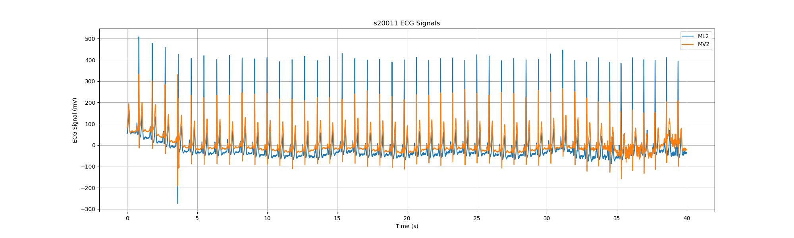
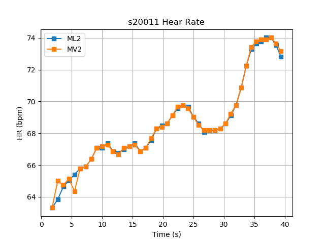
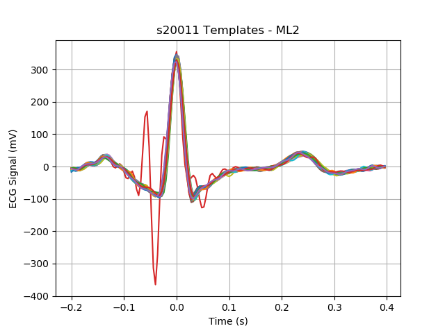

# Compressed Sensing on Physiology Signal Sensing Platform

## System Requirements
1. Python 3.6
## Quick Start
1. Setup [Python virtual environment](https://virtualenv.pypa.io/en/latest/userguide/#usage) ```virtualenv ENV```, where ENV is a directory to place the new virtual environment
2. Install requirments ```pip  install -r requirements.txt```
3. Download dataset with ```python  scripts/download_dataset.py```
4. Instantiate hea dataset object by:
```python
from dataset.ltstdb_hea import LtstdbHea
hea = LtstdbHea.from_file("data/hea/s20011.hea")
# hea.signals is a list of HeaSignals
# hea.timestamps is a 1D numpy array containing timestamps corresponding to above signals
```
## Visualization
```
python scripts/plot_signals.py
```
Sample ouputs are shown below:





## Dataset Object Model

## Configuration File

## Acknowledgement
The authors of this software package would like to thank following authors and their efforts in setting up 
long-term S-T database.
    
> Franc Jager, Alessandro Taddei, George B. Moody, Michele Emdin, Gorazd Antolic, 
> Roman Dorn, Ales Smrdel, Carlo Marchesi, and Roger G. Mark. Long-term ST database: 
> a reference for the development and evaluation of automated ischaemia detectors and 
> for the study of the dynamics of myocardial ischaemia. Medical & Biological Engineering & 
> Computing 41(2):172-183 (2003).

And Physionet for hosting this dataset:        
> Goldberger AL, Amaral LAN, Glass L, Hausdorff JM, Ivanov PCh, Mark RG, Mietus JE, Moody GB,
> Peng C-K, Stanley HE. PhysioBank, PhysioToolkit, and PhysioNet: Components of a New Research
> Resource for Complex Physiologic Signals. Circulation 101(23):e215-e220 
> [http://circ.ahajournals.org/content/101/23/e215.full](); 2000 (June 13). 

## License 

Copyright 2018 Tao-Yi Lee, Delaram Amiri

Permission is hereby granted, free of charge, to any person obtaining a copy of this software and associated documentation files (the "Software"), to deal in the Software without restriction, including without limitation the rights to use, copy, modify, merge, publish, distribute, sublicense, and/or sell copies of the Software, and to permit persons to whom the Software is furnished to do so, subject to the following conditions:
The above copyright notice and this permission notice shall be included in all copies or substantial portions of the Software.

THE SOFTWARE IS PROVIDED "AS IS", WITHOUT WARRANTY OF ANY KIND, EXPRESS OR IMPLIED, INCLUDING BUT NOT LIMITED TO THE WARRANTIES OF MERCHANTABILITY, FITNESS FOR A PARTICULAR PURPOSE AND NONINFRINGEMENT. IN NO EVENT SHALL THE AUTHORS OR COPYRIGHT HOLDERS BE LIABLE FOR ANY CLAIM, DAMAGES OR OTHER LIABILITY, WHETHER IN AN ACTION OF CONTRACT, TORT OR OTHERWISE, ARISING FROM, OUT OF OR IN CONNECTION WITH THE SOFTWARE OR THE USE OR OTHER DEALINGS IN THE SOFTWARE.
